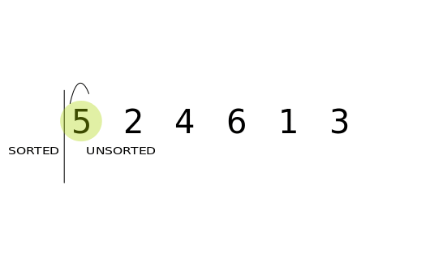

# Insertion sort
 
* In place algorithm.
* O(n^2) time complexity - quadratic.
* It will take 100 steps to sort 10 items, 10,000 steps to sort 100 items, 1,000,000 steps to sort 1,000 items.
* Stable algorithm.

