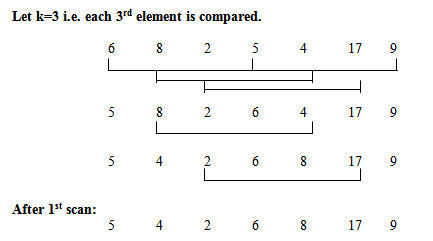

# Shell sort

* Variation of insertion sort.
* Insertion sort chooses which element to insert using a gap of 1.
* It starts out using a larger gap value.
* As the algorithm runs, the gap is reduced.
* Goal is to reduce the amount of shifting required.

* As the algorithm progresses, the gap is reduced.
* The last gap values is always 1.
* A gap value of 1 is equivalent to insertion sort.
* So, the algorithm does some preliminary work (using gap values greater than 1), and then becomes insertion sort.
* By the time we get to insertion sort, the array has been partially sorted, so there is less shifting required.

## Knuth Sequence

* Gap is calculated using (3^k - 1) / 2
* Set k based on the length of the array.
* We want the gap to be as close as possible to the length of the array we want to sort, without being greater than the length.

## Algorithm

* We will base our gap on the array's length. We'll initialize the gap (or interval) to array. length / 2
* On each iteration, we'll divide the gap value by 2 to get the next gap value

* In place algorithm.
* Difficult to nail down the time complexity cuz it will depend on the gap. Worst case: O(n^2), buit it can perform much better than that.
* Doesn't require as much shifting as insertion sort, so it usually performs better.
* Unstable algorithm.

