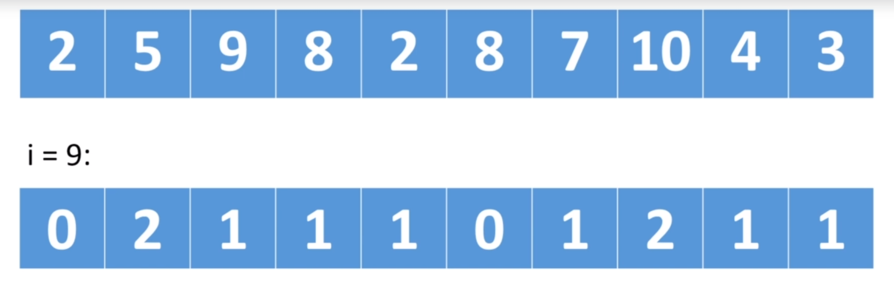
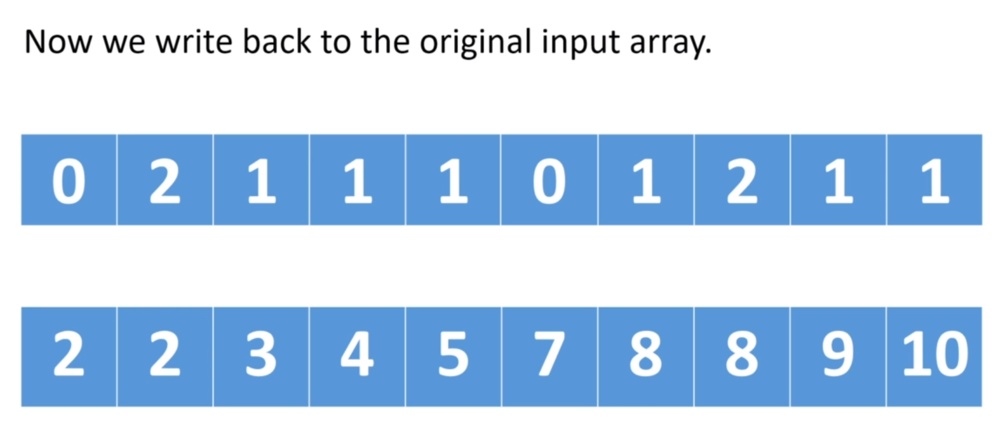

# Counting Sort

* Makes assumptions about the data
* Doesn't use comparisons
* Counts the number of occurrences of each value
* Only works with non negative discrete values (Can't work with floats, strings, etc)
* Values must be within a specific range

* Not an in-place algorithm
* O(k + n) - can achieve this cuz we're making assumptions about the data we're sorting
* Unstable algorithm. If we want the sort to be stable, we have to do some extra steps

### Process
* Create a count (frequency) array with the possible values (i.e. If we have items between 1-20 values, we create an array with length 20) 
* Iterate array and count in respective position in count array
* Create a new array in base with count array

##### Counting process
Up: Input array 
Down: Count (frequency) array

##### Counting process
Up: Count (frequency) array 
Down: Output array
