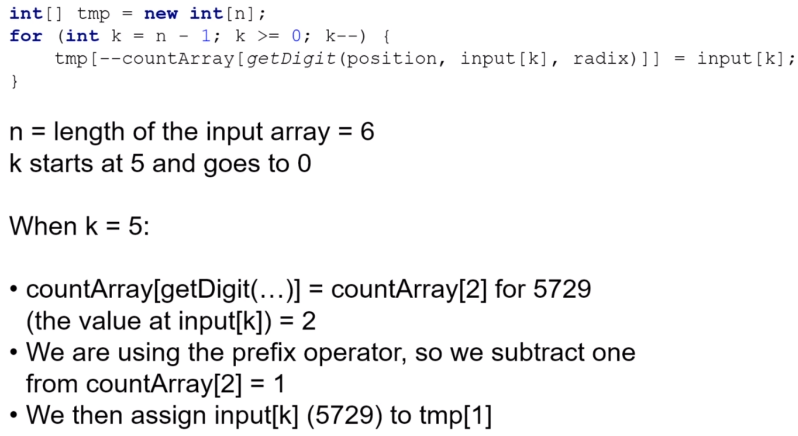
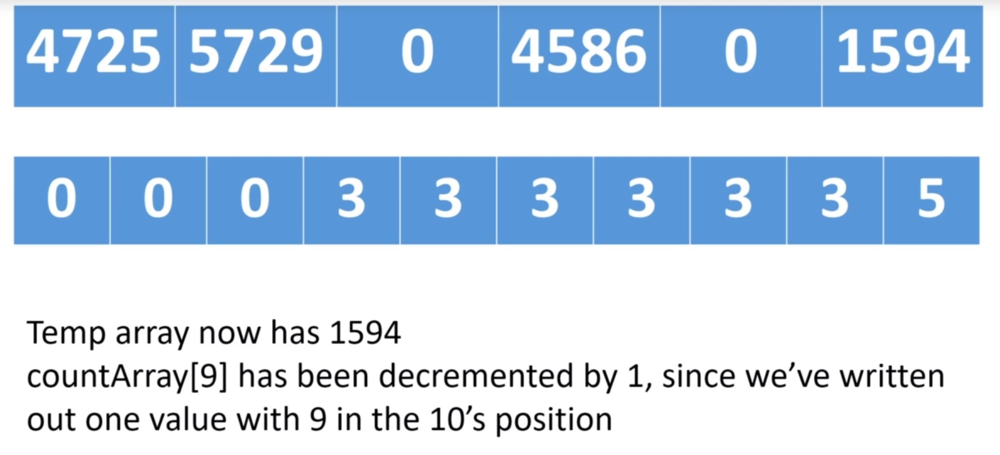

# Counting Sort

* Makes assumptions about the data
* Doesn't use comparisons
* Counts the number of occurrences of each value
* Only works with non negative discrete values (Can't work with floats, strings, etc)
* Values must be within a specific range
* Only good when the range of values is reasonable meaning and when the number of unique values won't be significantly great

* Not an in-place algorithm
* O(k + n) - can achieve this cuz we're making assumptions about the data we're sorting
* Unstable algorithm. If we want the sort to be stable, we have to do some extra steps
 

### Process
* Create a count (frequency) array with the possible values (i.e. If we have items between 1-20 values, we create an array with length 20) 
* Iterate array and count in respective position in count array
* Create a new array in base with count array

##### Counting phase
Up: Input array 
Down: Count (frequency) array

##### Write phase
Up: Count (frequency) array 
Down: Output array

# Stable Counting Sort

* Requires extra steps
* Can calculate where values should be written back to the original array
* Writing the values into the array in backwards order ensures stability

* This works cuz we traverse the input array from right to left, and we write duplicates values into the temp array from right to left
* If we know that duplicate values will go into positions 3 and 4, we write the rightmost value in the input array into position 4, and the leftmost values into position 3
* This preserves the relative positioning of duplicate values
* By adjusting the counting array after the initial pass, we can map values to indices in the temp array
* Can also use linked lists to make counting sort stable

##### Counting 10's positions

##### Result counting array

##### Process

##### Iteration 1

##### Iteration 2

##### Iteration 3

##### Iteration 4

##### Iteration 5

##### Iteration 6

