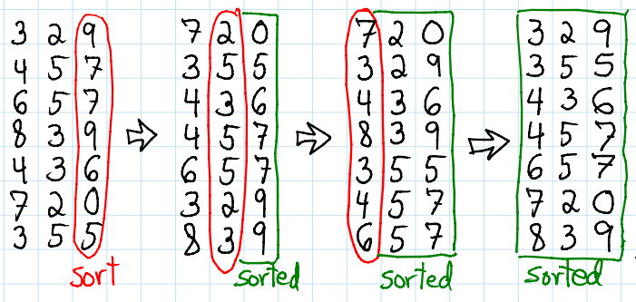

# Radix Sort

* Makes assumptions about the data
* Data must have same radix and width
* The radix is the number of unique digits or values in the case of characters that a numbering system or an alphabet has (e.g. the radix for the decimal system is 10)
* The with is the length of each data
* Cuz of this, data must be integers or strings
* <b>Sort based on each individual digit or letter position</b>
* Start at the rightmost position
* Must use a <b>stable sort algorithm</b> at each stage

 

### Extra info
* Counting sort is often used as the sort algorithm for radix sort - must be stable counting sort 
* O(n) - can achieve this beacuse we're making assumptions about the data we're sorting
* Even so, it often runs slower than o(nlogn) algorithms 'cause of the overhead involved
* In-place depends on which sort algorithm you use
* Stable algorithm

##### Process
